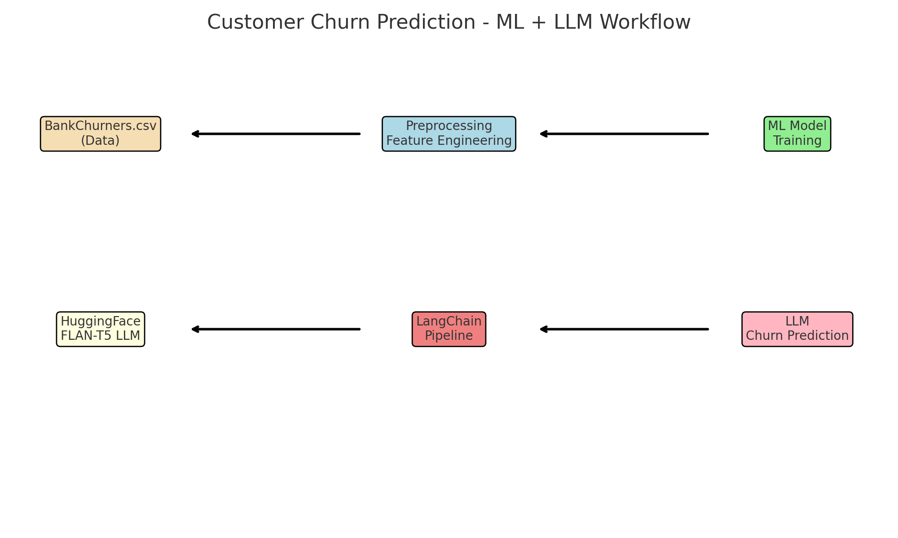

# Customer Churn Prediction using LLM and ML

This project uses Machine Learning (ML) models and a Language Model (LLM) to predict **customer churn** in a bank dataset. It leverages **LangChain**, **HuggingFace**, and **scikit-learn** to integrate ML with modern LLM workflows.

## Project Overview

- ✅ Load and explore the **BankChurners.csv** dataset
- ✅ Train a Machine Learning model for churn prediction
- ✅ Use a Hugging Face LLM (`flan-t5-base`) to generate human-like insights
- ✅ Integrate LLM with LangChain pipelines
- ✅ Predict customer churn with both ML and LLM-based models

## Files

| File | Description |
|:-----|:------------|
| `Customer_Churn_LLM_Corrected.ipynb` | Complete Jupyter Notebook containing the code for training, LLM integration, and prediction. |
| `BankChurners.csv` | Dataset with customer features for churn prediction. |

## Technologies Used

- Python 3.11+
- Pandas
- Scikit-learn
- Transformers (HuggingFace)
- LangChain
- Matplotlib (for visualization)
- Google FLAN-T5 (LLM)

## Setup Instructions

1. **Clone this repo**
   ```bash
   git clone https://github.com/your-username/your-repo-name.git
   cd your-repo-name
   ```

2. **Install Dependencies**
   ```bash
   pip install -r requirements.txt
   ```

3. **Run the Jupyter Notebook**
   Launch:
   ```bash
   jupyter notebook Customer_Churn_LLM_Corrected.ipynb
   ```

## Quick Demo

Sample Workflow:
- Load dataset → Preprocess → Train ML model → Predict churn
- Load LLM (`flan-t5-base`) → Generate churn explanations and predictions
- Wrap the HuggingFace pipeline using **LangChain**

| ML Model Output | LLM Output |
|:---|:---|
| `Customer will likely churn.` | `The customer is predicted to leave based on their activity.` |

## Sample Visualizations

📊 Graphs generated to analyze churn distribution, customer demographics, etc.

🤖 Text outputs generated by LLM explaining churn reasons.

## Workflow Diagram

Here’s an overview of the ML + LLM integration for churn prediction:



## Future Improvements

- Fine-tune LLM on banking-specific churn data
- Deploy a live API for real-time churn predictions
- Integrate dashboard visualization (e.g., Streamlit, Gradio)

## Acknowledgements

- [Google FLAN-T5 model](https://huggingface.co/google/flan-t5-base)
- [Hugging Face Transformers](https://huggingface.co/docs/transformers/index)
- [LangChain](https://python.langchain.com/)
